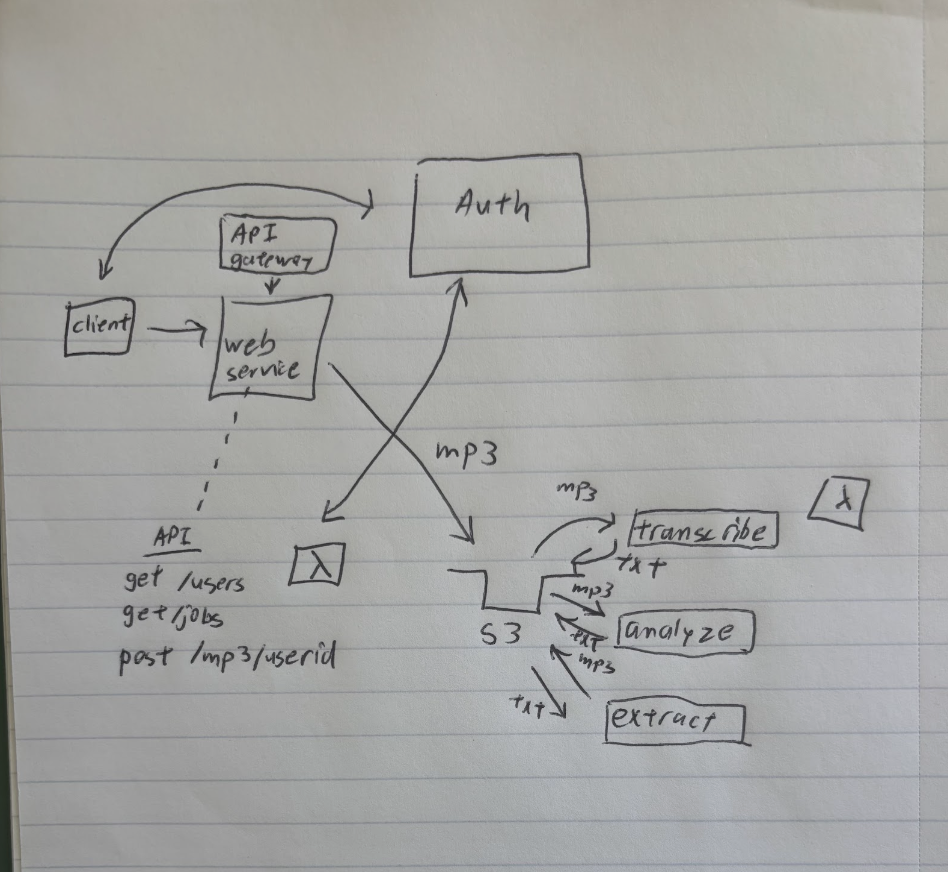

# Voice Impersonation Detector API Design

Our project is a voice impersonation detector that determines whether an audio recording is real or AI-generated by analyzing speech patterns and anomalies. 

## 🚀 API Overview
Endpoint: /mp3/{userid}

Instead of multiple endpoints, everything happens automatically after calling the client function /mp3. This calls a lambda function to upload the mp3 file, and this triggers the other backend functionsin a chain, so the user just uploads a file and waits for the results. 

## 🛠️ Project Workflow

| Step                | AWS Service / Python Module Used | Lambda Function        | Description                                | How is it Invoked?                                 |
|---------------------|----------------------------------|------------------------|--------------------------------------------|-----------------------------------------------------|
| Upload MP3          | API Gateway & S3                 | `final_proj_upload`    | Stores MP3 in S3 and starts processing     | Invoked via `/mp3/{userid}` POST request            |
| Speech-to-Text      | Amazon Transcribe                | `final_proj_transcribe`| Converts audio to text                     | Invoked when an MP3 is uploaded to S3               |
| Sentiment Analysis  | Amazon Comprehend                | `final_proj_analyze`   | Checks for tone inconsistencies            | Invoked by `final_proj_transcribe` after transcription |
| Metadata Extraction | mutagen                          | `final_proj_extract`   | Checks for suspicious patterns in metadata | Invoked by `final_proj_analyze` after sentiment analysis |

## 📊 Diagram


## 🔄 API Workflow Documentation

### 1. Upload Function (final_proj_upload)
- **Endpoint**: `/mp3/{userid}`
- **HTTP Verb**: POST
- **Request Parameters**:
  - `userid` (int): ID of the user uploading the file
- **Response**:
  - **Success**
    - Status code: 200
    - Body: `jobid`
  - **Bad Request**
    - Status code: 400
    - Body: `"no such user ..."`
  - **Internal Server Error**
    - Status code: 500
    - Body: `str(err)`

### 2. Transcription Function (final_proj_transcribe)
- **No direct HTTP endpoint**
  - Triggered automatically via an S3 Event Notification when a new MP3 file is uploaded
- **Request Parameters**:
  - S3 key for the MP3 file
- **Response**:
  - **Internal Server Error**
    - Status code: 500
    - Body: `str(err)`

### 3. Analysis Function (final_proj_analyze)
- **No direct HTTP Endpoint**
  - Triggered by the transcription function via the Lambda SDK
- **Request Parameters**:
  - `"File_key"`: `"filename.txt"`
  - `"Text"`: `"transcribed text..."`
  - `"Audio_key"`: `"audio.mp3"`
- **Response**:
  - **Success**
    - Status code: 200
    - Body:
      ```json
      {
        "file_key": "file_key",
        "results_file": "bucketkey_results_file",
        "sentiment": "sentiment",
        "sentiment_scores": "sentiment_scores",
        "tone_score": "tone_score",
        "ai_speech_likelihood": "ai_likelihood",
        "s3_file": "s3://BUCKET_NAME/bucketkey_results_file"
      }
      ```
  - **Error**
    - Status code: 500
    - Body: `str(err)`

### 4. Extraction Function (final_proj_extract)
- **No direct HTTP Endpoint**
  - Triggered by the Analysis function via the Lambda SDK
- **Request Parameters**:
  - `"File_key"`: `"filename.txt"`
  - `"Text"`: `"transcribed text..."`
  - `"Audio_key"`: `"audio.mp3"`
- **Response**:
  - **Success**
    - Status code: 200
    - Body:
      ```json
      {
        "message": "Analysis completed and results file updated successfully",
        "bucketkey": "bucketkey_results_file"
      }
      ```
  - **Error**
    - Status code: 500
    - Body: `str(err)`


## 🗃️ Database Schema

### Jobs Table
| Column | Type | Description |
|--------|------|-------------|
| jobid | int | Unique job ID |
| userid | int | User ID (links to the users table) |
| status | varchar | Job status (completed, error) |
| originaldatafile | varchar | Name of the uploaded MP3 file |
| datafilekey | varchar | S3 key for the MP3 file |
| resultsfilekey | varchar | S3 key for the final results file |

### Users Table
| Column | Type | Description |
|--------|------|-------------|
| userid | int | Unique user ID |
| username | varchar | User's name |
| pswhash | varchar | Hashed password for authentication |